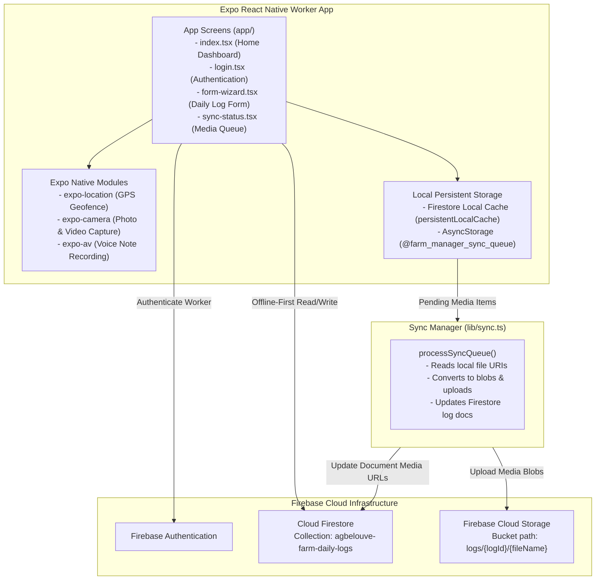

# Agbelouve Farm Manager - Worker App

An offline-first React Native mobile application built with Expo for farm workers and managers at Agbelouve Farm. The app enables daily log collection (morning and evening shifts), GPS location tagging, livestock/attendance tracking, and media uploads (photos, videos, and voice notes) with robust offline queueing capabilities.

---

## 🏗️ System Architecture

The app is architected with an **offline-first pattern**. All Firestore data mutations are cached locally using Firestore's `persistentLocalCache()`. Large binary media files (photos, videos, voice recordings) captured while offline are queued in `AsyncStorage` and uploaded to Firebase Cloud Storage when network connectivity is available.



---

## ✨ Features

- **Shift Log Wizards**: Separate guided forms for **MORNING** and **EVENING** farm operations.
- **GPS Location Tagging**: Automatic GPS coordinate capturing with accuracy metrics for geofence validation.
- **Worker Attendance & Livestock Tracking**: Real-time status entry for farm workers, goat herds, poultry, and cattle counts.
- **Rich Media Attachments**:
  - **Photos**: Minimum requirement of 2 photos per daily log.
  - **Video**: Up to 60-second video recording of farm activities.
  - **Voice Notes**: Integrated audio recorder for quick verbal reports.
- **Resumable Upload Engine & Live Feedback**: Real-time progress bar modal (`form-wizard.tsx`) during online uploads powered by Firebase `uploadBytesResumable`.
- **Offline Queue Inspector**: Visual queue dashboard (`sync-status.tsx`) with status badges (`PENDING`, `UPLOADING`, `FAILED`, `COMPLETED`), retry controls, and clear completed action.
- **Bilingual Interface**: Dual English / French labeling across all form fields and action buttons.


---

## 📁 Repository Structure

- [`app/`](file:///home/kwami/code-projects/farm-manager/worker-app/app): Expo Router screens and file-based routing stack.
  - [`_layout.tsx`](file:///home/kwami/code-projects/farm-manager/worker-app/app/_layout.tsx): Stack navigator & header theme customization.
  - [`index.tsx`](file:///home/kwami/code-projects/farm-manager/worker-app/app/index.tsx): Main landing page and shift selector.
  - [`login.tsx`](file:///home/kwami/code-projects/farm-manager/worker-app/app/login.tsx): Authentication page.
  - [`form-wizard.tsx`](file:///home/kwami/code-projects/farm-manager/worker-app/app/form-wizard.tsx): Guided log collection wizard.
  - [`sync-status.tsx`](file:///home/kwami/code-projects/farm-manager/worker-app/app/sync-status.tsx): Queue inspector and upload trigger.
- [`lib/`](file:///home/kwami/code-projects/farm-manager/worker-app/lib): Shared helpers and API interfaces.
  - [`firebase.ts`](file:///home/kwami/code-projects/farm-manager/worker-app/lib/firebase.ts): Firebase configuration & offline persistence setup.
  - [`sync.ts`](file:///home/kwami/code-projects/farm-manager/worker-app/lib/sync.ts): Queue state management & background media upload processor.
- [`add-test-data.mjs`](file:///home/kwami/code-projects/farm-manager/worker-app/add-test-data.mjs): Utility script to insert mock log data into Firestore.

---

## 🚀 Getting Started

### Prerequisites
- Node.js (v18+)
- npm or yarn
- Expo Go app on mobile device OR Android Studio / Xcode emulator.

### Installation

```bash
# Install dependencies
npm install
```

### Running the App

```bash
# Start Expo development server
npm start

# Run directly on Android
npm run android

# Run directly on iOS
npm run ios

# Run in Web browser
npm run web
```

### Adding Seed Test Data

To push a sample daily log document to the Firestore database:

```bash
node add-test-data.mjs
```

---

## 📢 Mandatory Maintenance Directive

> [!IMPORTANT]
> **All contributors and AI agents MUST update [`AGENTS.md`](file:///home/kwami/code-projects/farm-manager/worker-app/AGENTS.md), [`README.md`](file:///home/kwami/code-projects/farm-manager/worker-app/README.md), and [`CHANGELOG.md`](file:///home/kwami/code-projects/farm-manager/worker-app/CHANGELOG.md) whenever changes are made to this repository.** Updates must clearly outline the **WHAT**, **WHY**, and **HOW** behind each modification.
