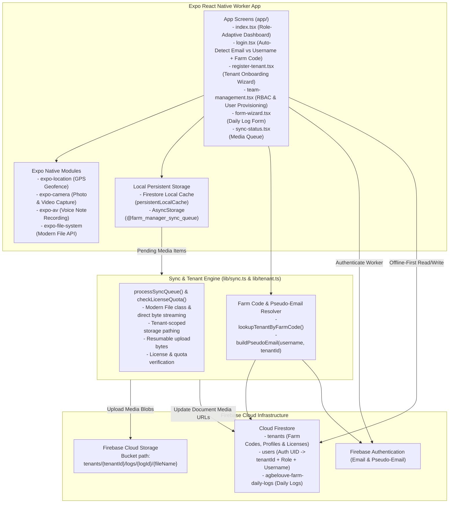

# Agbelouve Farm Manager - Worker App

An offline-first React Native mobile application built with Expo for farm workers and managers at Agbelouve Farm. The app enables daily log collection (morning and evening shifts), GPS location tagging, livestock/attendance tracking, and media uploads (photos, videos, and voice notes) with robust offline queueing capabilities.

---

## 🏗️ System Architecture

The app is architected with an **offline-first pattern**. All Firestore data mutations are cached locally using Firestore's `persistentLocalCache()`. Large binary media files (photos, videos, voice recordings) captured while offline are queued in `AsyncStorage` and uploaded to Firebase Cloud Storage when network connectivity is available.



---

## ✨ Features

- **Multi-Tenant Architecture**: Full tenant data isolation using `tenantId` scoped collections and Cloud Storage buckets.
- **Collision-Free Unique Farm Codes**: Auto-generates unique 6-8 character farm codes (e.g. `AGBE4821`) during registration so workers can quickly connect without complex IDs.
- **Worker Username Authentication**: Farm workers without email addresses can connect using their **Username + Farm Code + Password**, mapped securely to deterministic pseudo-emails behind the scenes.
- **Smart Login Auto-Detection**: Single login input field automatically detects email vs worker username and conditionally prompts for the Farm Code.
- **Modern File System Integration**: Fully migrated to the new `expo-file-system` `File` class for direct binary byte access without legacy deprecated methods.
- **Role-Based Access Control (RBAC)**: Support for four user roles:
  - **Owner**: Full tenant administration, team creation, and quota monitoring.
  - **Admin**: User provisioning and farm operational oversight.
  - **Supervisor**: Log creation, team shift reviews, and sync monitoring.
  - **Worker**: Shift log entry and media recording.
- **In-App Team Management**: Owners and Admins can create and add team members (Email or Username-based) during registration or post-creation via `team-management.tsx`.
- **Licensing & Quotas Hooks**: Built-in quota check hooks (`checkLicenseQuota`) for tracking active user counts and Cloud Storage bytes.
- **Shift Log Wizards**: Guided forms for **MORNING** and **EVENING** farm operations.
- **GPS Location Tagging**: Automatic GPS coordinate capturing for geofence validation.
- **Rich Media Attachments**: Photos, videos, and voice note recordings with resumable upload progress.
- **Offline Sync Queue**: Visual queue dashboard (`sync-status.tsx`) for tracking offline uploads and triggering manual syncs.
- **Bilingual Interface**: Dual English / French labeling.

---

## 📁 Repository Structure

- [`app/`](file:///home/kwami/code-projects/farm-manager/worker-app/app): Expo Router screens and file-based routing stack.
  - [`_layout.tsx`](file:///home/kwami/code-projects/farm-manager/worker-app/app/_layout.tsx): Stack navigator & header theme customization.
  - [`index.tsx`](file:///home/kwami/code-projects/farm-manager/worker-app/app/index.tsx): Main landing page with user role badge.
  - [`login.tsx`](file:///home/kwami/code-projects/farm-manager/worker-app/app/login.tsx): Smart login supporting email and username + Farm Code.
  - [`register-tenant.tsx`](file:///home/kwami/code-projects/farm-manager/worker-app/app/register-tenant.tsx): Tenant onboarding wizard for farm owners with auto-generated Farm Code.
  - [`team-management.tsx`](file:///home/kwami/code-projects/farm-manager/worker-app/app/team-management.tsx): User management dashboard supporting both email and username accounts.
  - [`form-wizard.tsx`](file:///home/kwami/code-projects/farm-manager/worker-app/app/form-wizard.tsx): Guided log collection wizard.
  - [`sync-status.tsx`](file:///home/kwami/code-projects/farm-manager/worker-app/app/sync-status.tsx): Queue inspector and upload trigger.
- [`lib/`](file:///home/kwami/code-projects/farm-manager/worker-app/lib): Shared helpers and API interfaces.
  - [`firebase.ts`](file:///home/kwami/code-projects/farm-manager/worker-app/lib/firebase.ts): Firebase configuration & offline persistence setup.
  - [`tenant.ts`](file:///home/kwami/code-projects/farm-manager/worker-app/lib/tenant.ts): Multi-tenant models, Farm Code auto-generator, pseudo-email auth, and quota hooks.
  - [`sync.ts`](file:///home/kwami/code-projects/farm-manager/worker-app/lib/sync.ts): Queue state management & modern `File` class media upload processor.
- [`firestore.rules`](file:///home/kwami/code-projects/farm-manager/worker-app/firestore.rules): Production Firestore security rules enforcing multi-tenant isolation & RBAC.
- [`storage.rules`](file:///home/kwami/code-projects/farm-manager/worker-app/storage.rules): Production Cloud Storage rules scoping bucket access by `tenantId`.
- [`firebase.json`](file:///home/kwami/code-projects/farm-manager/worker-app/firebase.json): Firebase CLI project manifest.
- [`add-test-data.mjs`](file:///home/kwami/code-projects/farm-manager/worker-app/add-test-data.mjs): Utility script to insert mock log data into Firestore.

---

## 🔒 Deploying Firebase Security Rules

To deploy the multi-tenant security rules to your live Firebase project using Firebase CLI:

```bash
# Login to Firebase
npx firebase login

# Deploy rules only
npx firebase deploy --only firestore:rules,storage
```

---

## 📱 Building the App with EAS

```bash
# Build Android APK (Preview)
npx eas build --platform android --profile preview

# Build iOS App
npx eas build --platform ios --profile preview
```
